### Praktikum 1: Menerapkan Control Flows ("if/else")

1. Silakan coba eksekusi (Run) kode pada langkah 1 tersebut. Apa yang terjadi? Jelaskan!
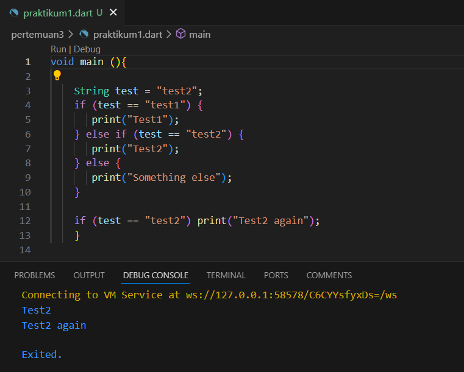
yang terjadi adalah menampilkan output test2 dan test2 again. Karena kondisi kedua yang terpenuhi maka akan menampilkan test2. Kemudian Kondisi kedua dari pernyataan if yang terpisah juga terpenuhi, sehingga "Test2 again" dicetak.

2. Apa yang terjadi ? Jika terjadi error, silakan perbaiki namun tetap menggunakan if/else.
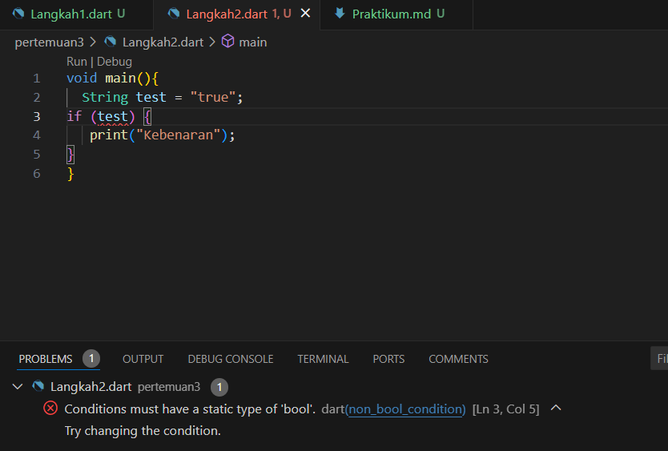
Dalam Dart, pernyataan if memerlukan kondisi yang berupa nilai boolean (true atau false). Namun, dalam kode Anda, test adalah sebuah String, bukan nilai boolean. Ini akan menyebabkan error saat kompilasi.
pembenaran :
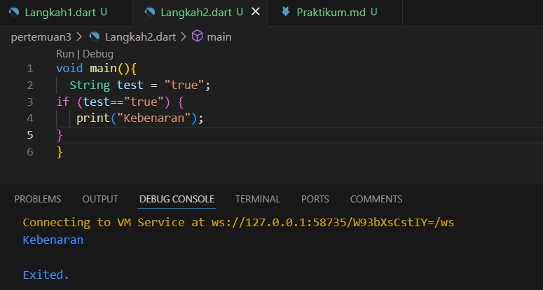

### Praktikum 2: Menerapkan Perulangan "while" dan "do-while"
1. Langkah 1: Ketik atau salin kode program berikut ke dalam fungsi main().
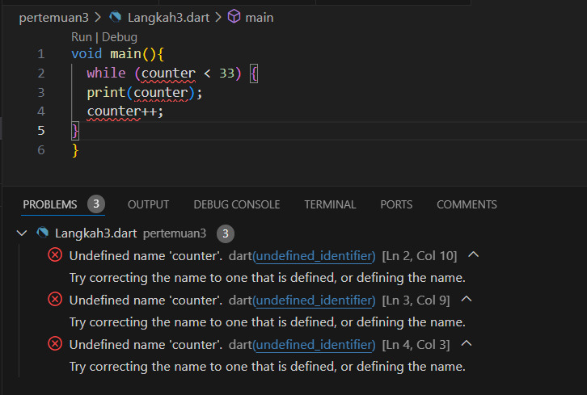
Silakan coba eksekusi (Run) kode pada langkah 1 tersebut. Apa yang terjadi? Jelaskan! Lalu perbaiki jika terjadi error.
jawab :
variabel counter belum dideklarasikan atau diinisialisasi dalam kode tersebut. Sehingga menyebabkan eror. maka harus diinisialisasikan dulu sehingga mendapatkan output dengan menampilkan angka sampai 32 seperti berikut :
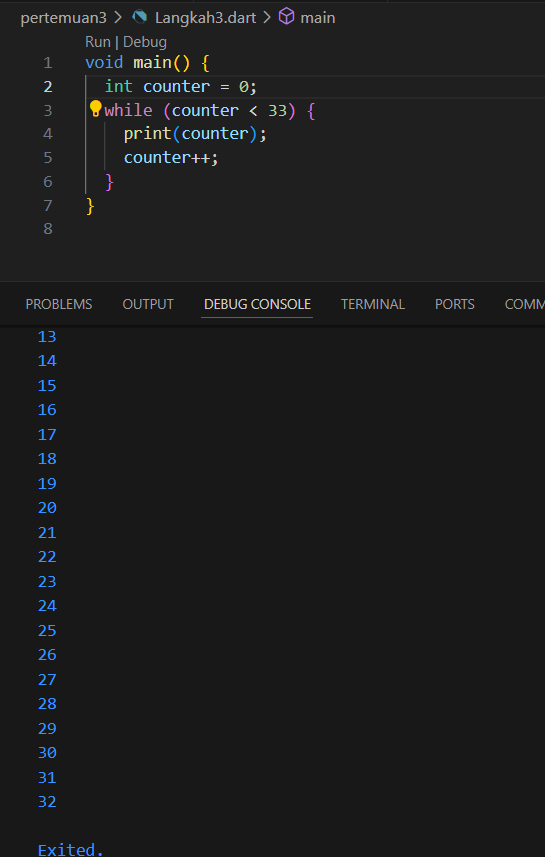

2. Tambahkan kode program berikut, lalu coba eksekusi (Run) kode Anda.

do {
  print(counter);
  counter++;
} while (counter < 77);

Apa yang terjadi ? Jika terjadi error, silakan perbaiki namun tetap menggunakan do-while.
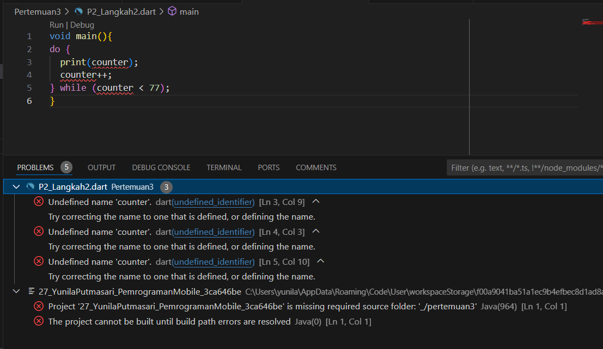
akan terjadi eror karena counter yang digunakan dalam loop do-while belum dideklarasikan atau diinisialisasi ini akan menyebabkan error.
perbaikan :
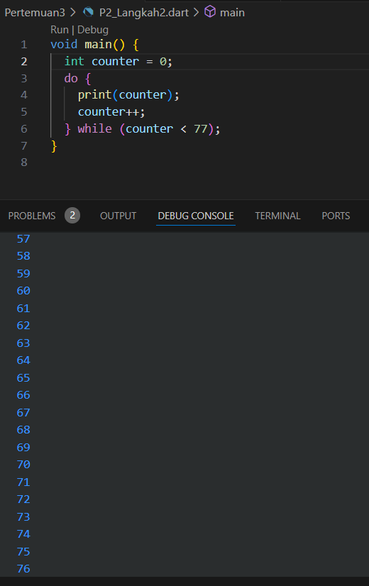
akan menampilkan angka sampai 76 sesuai dengan kondisi yang diinginkan di iterasinya yaitu sampai < 77.

### Praktikum 3: Menerapkan Perulangan "for" dan "break-continue"
1. Ketik atau salin kode program berikut ke dalam fungsi main().

for (Index = 10; index < 27; index) {
  print(Index);
}
2. Silakan coba eksekusi (Run) kode pada langkah 1 tersebut. Apa yang terjadi? Jelaskan! Lalu perbaiki jika terjadi error.
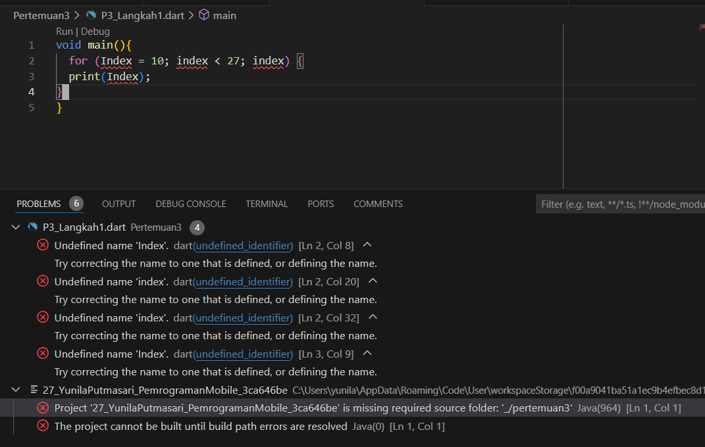
akan terjadi eror karena belum di deklarasikan variabel index nya dan juga tidak ada opeartor incrementnya.
perbaikan :
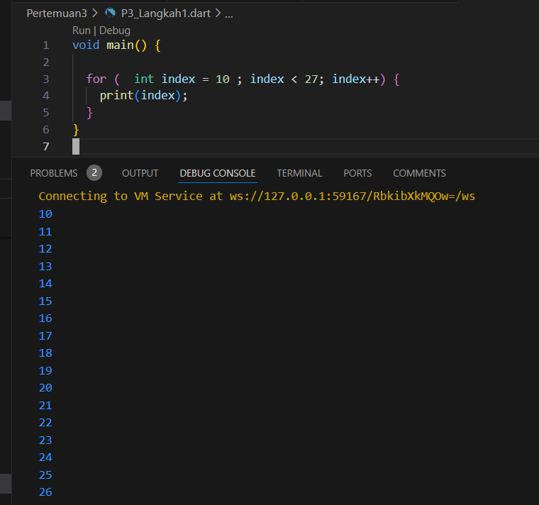
jika sudah diperbaiki maka akan menampilkan angka sampai 26 karena sesuai dengan kondisinya.

3. Tambahkan kode program berikut di dalam for-loop, lalu coba eksekusi (Run) kode Anda.
    If (Index == 21) break;
    Else If (index > 1 || index < 7) continue;
    print(index);
Apa yang terjadi ? Jika terjadi error, silakan perbaiki namun tetap menggunakan for dan break-continue.
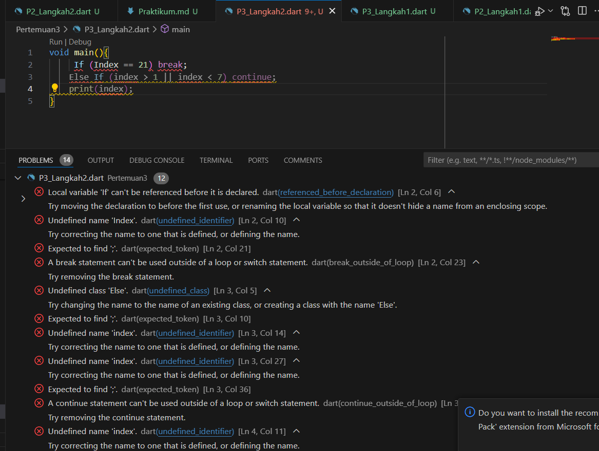
akan menampilkan eror karena penggunaan if else dengan huruf kapital, kemudian penggunaan break dan continue ditempat yang salah.  Karena break dan continue biasanya ada di for, while, do-while. 
perbaikan :
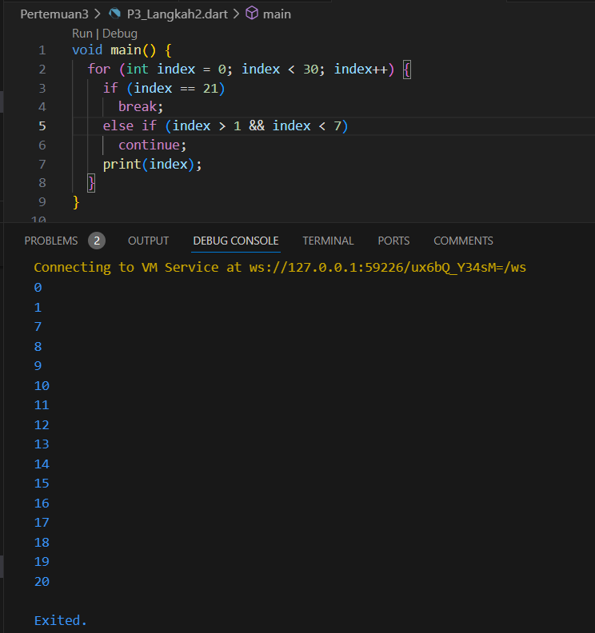
sesuai dengan yang diinginkan maka akan melewatkan angka yang lebih dari 1 dan kurang dari 7. Dan akan menghentikan angka di sebelum 21.

### Tugas
Buatlah sebuah program yang dapat menampilkan bilangan prima dari angka 0 sampai 201 menggunakan Dart. Ketika bilangan prima ditemukan, maka tampilkan nama lengkap dan NIM Anda.
1. code :
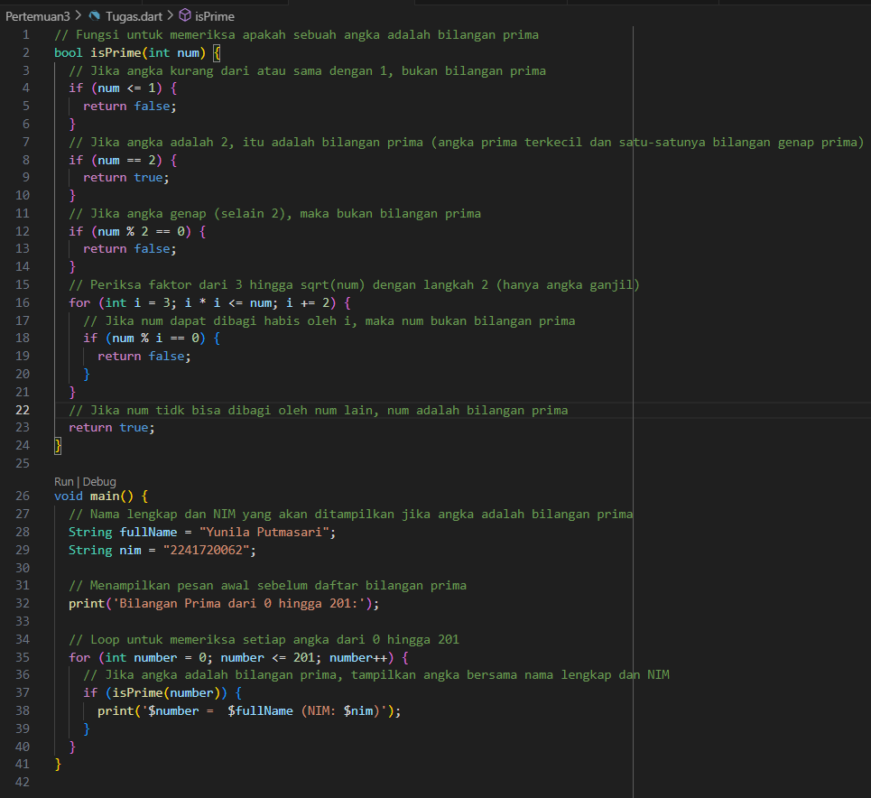
2. hasil :
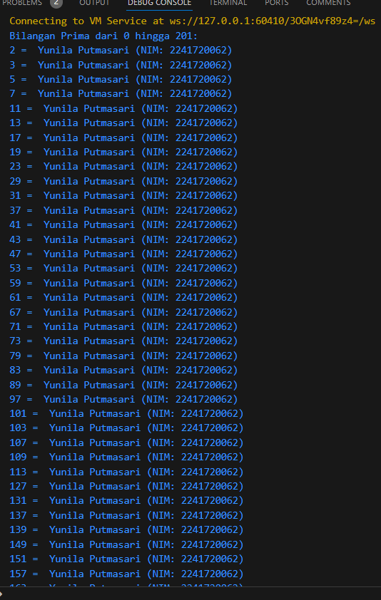

