### Tugas Praktikum

1. Silakan selesaikan Praktikum 1 sampai 5, lalu dokumentasikan berupa screenshot hasil pekerjaan Anda beserta penjelasannya!
2. Jelaskan yang dimaksud Functions dalam bahasa Dart!
jawab :
Dalam bahasa Dart, functions adalah blok kode yang dapat diberi nama atau anonim yang dirancang untuk menjalankan tugas tertentu dan bisa dipanggil di berbagai tempat dalam program. Fungsi memudahkan dalam mengorganisir kode, meningkatkan keterbacaan, dan memungkinkan penggunaan kembali kode (reusability).

3. Jelaskan jenis-jenis parameter di Functions beserta contoh sintaksnya!
jawab :
- parameter prositional :
    Parameter yang harus diisi dalam urutan yang sama seperti yang dideklarasikan dalam fungsi. Ada dua tipe parameter positional: wajib dan opsional.
    - Parameter Positional Wajib: Parameter ini harus diisi saat pemanggilan fungsi dan urutannya harus sesuai dengan deklarasi.
    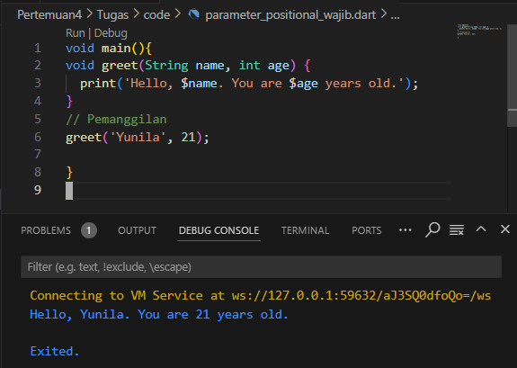
    - Parameter Positional Opsional: Parameter ini opsional dan dideklarasikan dalam tanda kurung kotak [ ]. Jika tidak diberikan, nilai default-nya adalah null.
    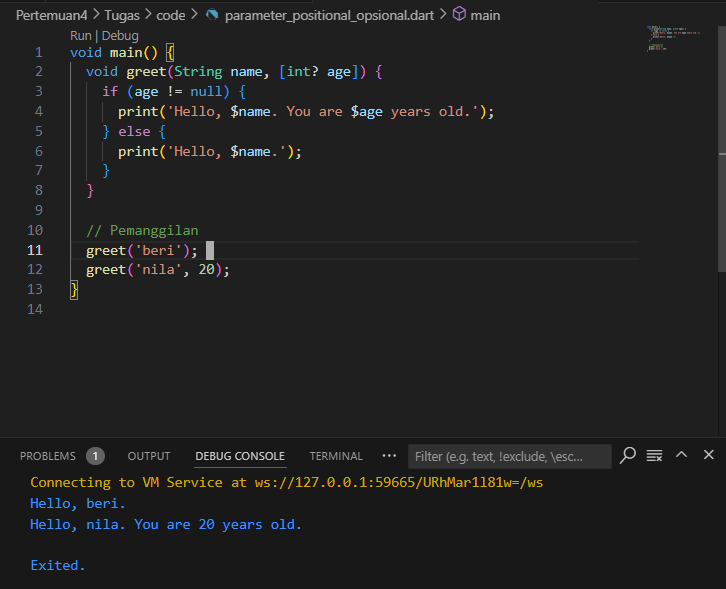
- Parameter Named
    Parameter yang disebutkan dengan nama saat pemanggilan fungsi, sehingga urutannya tidak penting. Dideklarasikan dalam tanda kurung kurawal { }.
    - Parameter Named Wajib: Harus disertakan saat pemanggilan fungsi dan dideklarasikan dengan tipe @required dalam konstruktor kelas atau menggunakan default value jika tidak ingin menggunakan anotasi @required.
    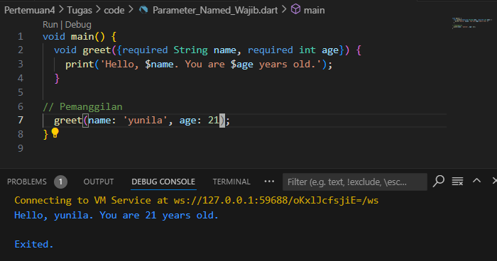
    - Parameter Named Opsional: Tidak perlu disertakan saat pemanggilan fungsi. Nilai default bisa diberikan jika tidak ada nilai yang diisi.
    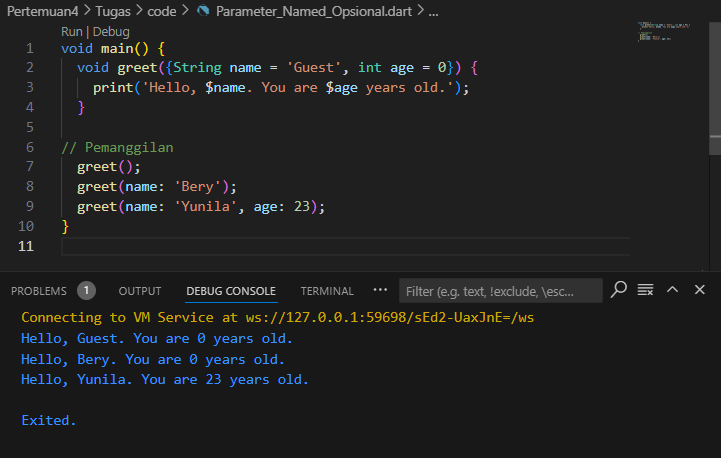
- Parameter Default
    Parameter yang memiliki nilai default jika tidak diberikan saat pemanggilan fungsi. Biasanya digunakan bersama parameter named.
    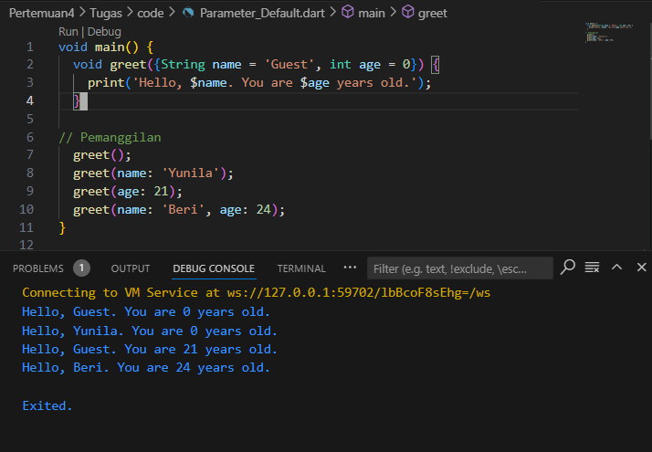

4. Jelaskan maksud Functions sebagai first-class objects beserta contoh sintaknya!
jawab :
Dalam bahasa Dart, functions dianggap sebagai first-class objects. Ini berarti bahwa fungsi dapat diperlakukan seperti objek biasa dalam bahasa pemrograman, yang memungkinkan berbagai operasi yang sama seperti objek lainnya. Berikut adalah beberapa konsep penting yang berkaitan dengan fungsi sebagai first-class objects:

- Konsep Fungsi Sebagai First-Class Objects
Fungsi sebagai Nilai (Value) Fungsi dapat disimpan dalam variabel, diteruskan sebagai argumen ke fungsi lain, dan dikembalikan sebagai hasil dari fungsi. Ini memungkinkan fleksibilitas tinggi dalam pemrograman.
- Fungsi sebagai Parameter Fungsi dapat diteruskan sebagai parameter ke fungsi lain. Ini berguna untuk menerapkan pola desain seperti callback atau higher-order functions.
- Fungsi sebagai Hasil Fungsi dapat dikembalikan sebagai hasil dari fungsi lain, yang memungkinkan pembuatan fungsi yang dinamis atau fungsi yang lebih kompleks berdasarkan input.

 contoh sintaks :
- Menyimpan Fungsi dalam Variabel
    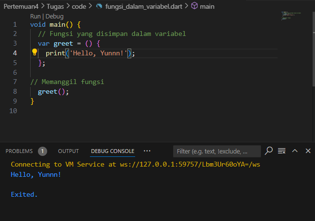
- fungsi sebagai parameter
    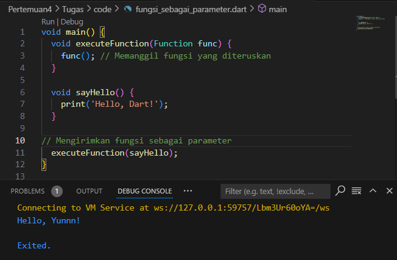
- fungsi yang mengembaikan fungsi
    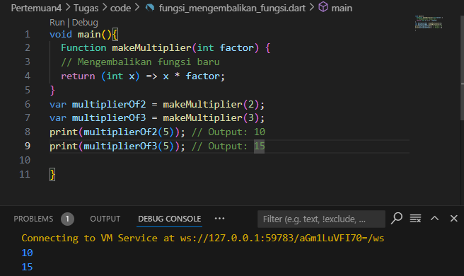
- fungsi anonim
    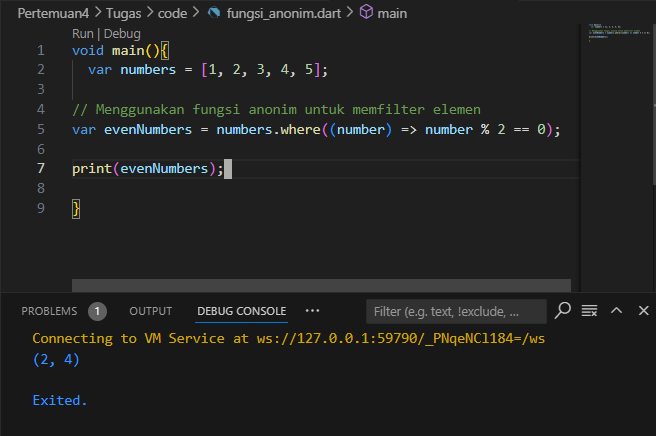

5. Apa itu Anonymous Functions? Jelaskan dan berikan contohnya!
jawab :
Anonymous functions (atau lambda functions) adalah fungsi yang tidak memiliki nama. Fungsi ini sering digunakan ketika kamu memerlukan fungsi kecil dan sederhana untuk digunakan langsung dalam konteks tertentu tanpa perlu mendeklarasikan fungsi dengan nama.
- fungsi anonim dalam ekspresi
    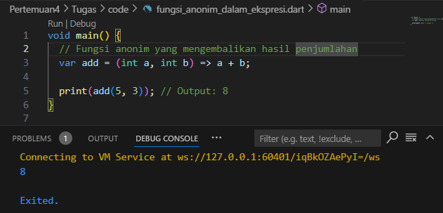
- fungsi anonim sebagai parameter
    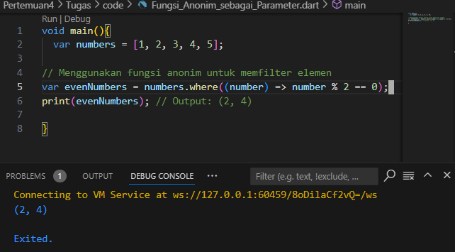
- fungsi anonim dalam callback
    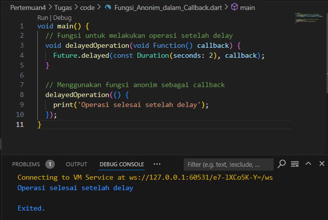

6. Jelaskan perbedaan Lexical scope dan Lexical closures! Berikan contohnya!
jawab :
    - Lexical scope mengacu pada aturan akses variabel berdasarkan di mana variabel itu dideklarasikan dalam kode.
    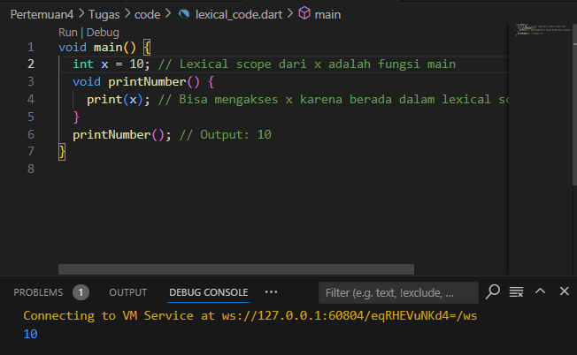

    - Lexical closure mengacu pada kemampuan fungsi untuk mengingat variabel dari lingkup di mana fungsi itu didefinisikan, bahkan jika fungsi itu dieksekusi di luar lingkup aslinya.
    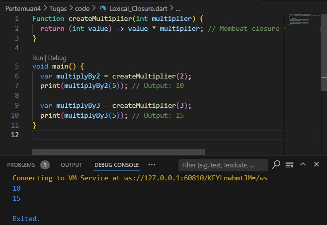

7. Jelaskan dengan contoh cara membuat return multiple value di Functions!
jawab :
- Menggunakan List untuk Return Multiple Values
    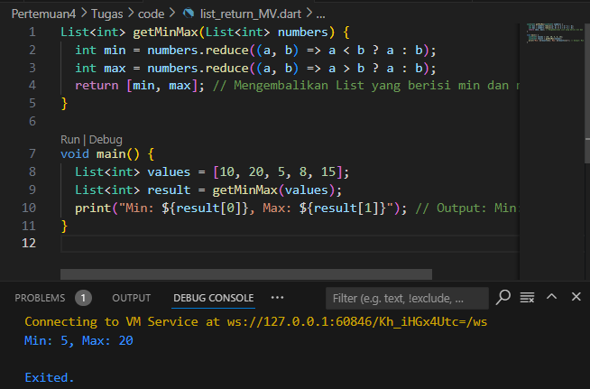
- Menggunakan Map untuk Return Multiple Values
    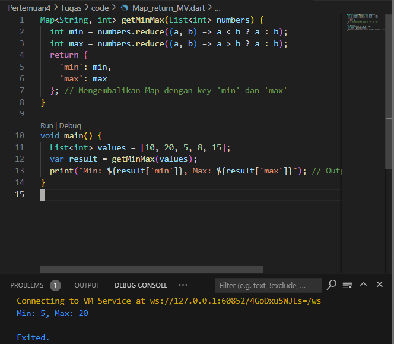
- Menggunakan Class untuk Return Multiple Values
    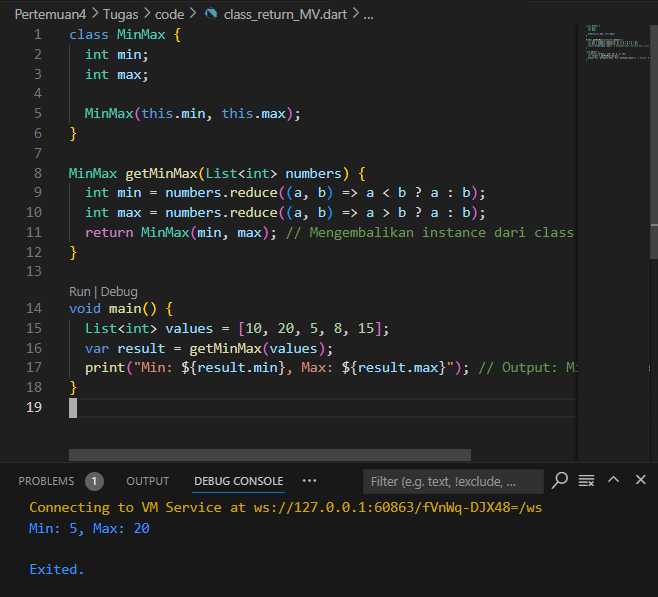

8. Kumpulkan berupa link commit repo GitHub pada tautan yang telah disediakan di grup Telegram!