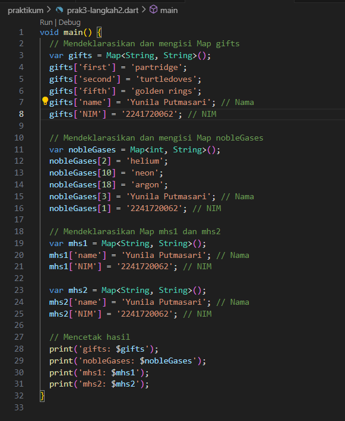
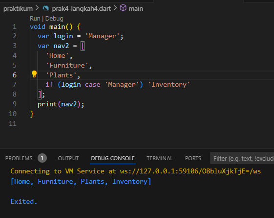

### praktikum1

1. Kemudian coba jalankan (Run) kode pada langkah 1 di atas. Apa yang telah terjadi? Mengosongkan!
jawab :

 pertama tama program mengecek panjang list apakah list nya ada 3, kemudian jika benar ada 3 maka akan dicek lagi apakah list[1] adalah 2. jika benar maka akan print panjang list nya, dan print angka pada list[1] yaitu 2.
selanjutnya merubah list[1] yang tadinya isinya angka 2 sekarang diganti menjadi angka 1. kemudian di cek apakah list[1] berisi angka 1, jika benar makan akan print list[1].

2. Ubah kode pada langkah 1 menjadi variabel final yang mempunyai index = 5 dengan default value = null. Isilah nama dan NIM Anda pada elemen index ke-1 dan ke-2. Lalu print dan capture hasilnya.
jawab :

### praktikum2
1. Silakan coba eksekusi (Run) kode pada langkah 1 tersebut. Apa yang terjadi? Jelaskan! Lalu perbaiki jika terjadi error.

seharusnya digunakan untuk mendeklarasikan sebuah Set jika menggunakan sintaks {} tanpa pasangan kunci-nilai. lebih baik jika menggunakan sintaks <String>{} untuk memastikan bahwa variabel halogens adalah Set<String>, yang benar-benar sebuah Set dengan tipe data String.

2. Apa yang terjadi ? Jika terjadi error, silakan perbaiki namun tetap menggunakan ketiga variabel tersebut. Tambahkan elemen nama dan NIM Anda pada kedua variabel Set tersebut dengan dua fungsi berbeda yaitu .add() dan .addAll(). Untuk variabel Map dihapus, nanti kita coba di praktikum selanjutnya.

pembenaran :

### praktikum3
1. Silakan coba eksekusi (Run) kode pada langkah 1 tersebut. Apa yang terjadi? Jelaskan! Lalu perbaiki jika terjadi error.

- Deklarasi: var gifts diinisialisasi sebagai Map<String, dynamic>. Ini berarti kunci (key) adalah String dan nilai (value) dapat berupa tipe data apa pun (dynamic).
- Deklarasi: var nobleGases diinisialisasi sebagai Map<int, dynamic>. Ini berarti kunci (key) adalah int dan nilai (value) dapat berupa tipe data apa pun (dynamic).

2. Apa yang terjadi ? Jika terjadi error, silakan perbaiki.
jawab :
gifts dan nobleGases tidak dideklarasikan dengan benar di dalam main(), sehingga kode akan menghasilkan error.

Tambahkan elemen nama dan NIM Anda pada tiap variabel di atas (gifts, nobleGases, mhs1, dan mhs2). Dokumentasikan hasilnya dan buat laporannya!
jawab :

### praktikum4
1. Silakan coba eksekusi (Run) kode pada langkah 1 tersebut. Apa yang terjadi? Jelaskan! Lalu perbaiki jika terjadi error.
sudah diperbaiki :

ada beberapa penamaan variabel yang tidak sama sehingga menyebabkan errror.
terdapat kode list2 adalah sebuah List baru.
[0, ...list1] menggunakan operator spread (...) untuk menyebarkan elemen dari list1 ke dalam list2.
0 adalah elemen pertama dari list2.
Operator ... mengikutkan semua elemen dari list1 setelah 0, sehingga list2 menjadi [0, 1, 2, 3].

2. Apa yang terjadi ? Jika terjadi error, silakan perbaiki.

Tambahkan variabel list berisi NIM Anda menggunakan Spread Operators. Dokumentasikan hasilnya dan buat laporannya!

3. Apa yang terjadi ? Jika terjadi error, silakan perbaiki. Tunjukkan hasilnya jika variabel promoActive ketika true dan false.
true :

false :

4. Apa yang terjadi ? Jika terjadi error, silakan perbaiki. Tunjukkan hasilnya jika variabel login mempunyai kondisi lain.

kondisi lain :

5. Apa yang terjadi ? Jika terjadi error, silakan perbaiki. Jelaskan manfaat Collection For dan dokumentasikan hasilnya.

#0 adalah elemen yang ditambahkan secara statis.
Elemen '#1', '#2', dan '#3' dihasilkan dari iterasi listOfInts dan diubah menjadi format string yang diinginkan.
manfaat :
- Generasi Dinamis: Memungkinkan pembuatan elemen list baru secara dinamis berdasarkan iterasi dari list atau koleksi lainnya.
- Keringkasan Kode: Mengurangi kebutuhan untuk menggunakan loop for terpisah dan memudahkan pembuatan koleksi dengan ekspresi yang bersih dan langsung.
- Peningkatan Keterbacaan: Menggunakan Collection For membuat kode lebih ringkas dan lebih mudah dibaca dibandingkan dengan loop biasa.

### praktikum5
1. Silakan coba eksekusi (Run) kode pada langkah 1 tersebut. Apa yang terjadi? Jelaskan! Lalu perbaiki jika terjadi error.

Fitur ini memungkinkan kita menggabungkan nilai dengan atau tanpa nama. Dalam contoh ini, record berisi dua nilai tanpa nama ('first' dan 'last'), serta dua nilai dengan nama (a: 2 dan b: true).Hasilnya ketika kita mencetak record, output menampilkan semua nilai, termasuk yang bernama.

2. Apa yang terjadi ? Jika terjadi error, silakan perbaiki. Gunakan fungsi tukar() di dalam main() sehingga tampak jelas proses pertukaran value field di dalam Records.

- Destructuring Records: Kode var (a, b) = record; digunakan untuk "memecah" Record menjadi dua variabel a dan b.
- Pertukaran Nilai: Setelah nilai a dan b diekstrak, kode return (b, a); akan mengembalikan Record baru dengan nilai yang ditukar.

3. Apa yang terjadi ? Jika terjadi error, silakan perbaiki. Inisialisasi field nama dan NIM Anda pada variabel record mahasiswa di atas. Dokumentasikan hasilnya dan buat laporannya!

variabel mahasiswa dideklarasikan dahulu supaya tidak eror. 
Record (String, int) harus diinisialisasi dengan nilai yang sesuai, dalam hal ini ('Yunila Putmasari', 2241720062).
Field pertama berisi nama (String), dan field kedua berisi NIM (int).

4. Apa yang terjadi ? Jika terjadi error, silakan perbaiki. Gantilah salah satu isi record dengan nama dan NIM Anda, lalu dokumentasikan hasilnya dan buat laporannya!

