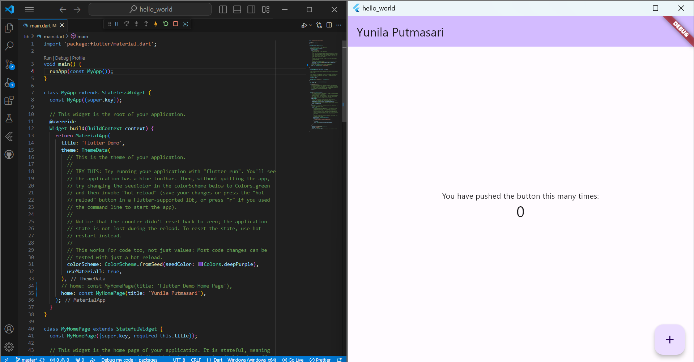
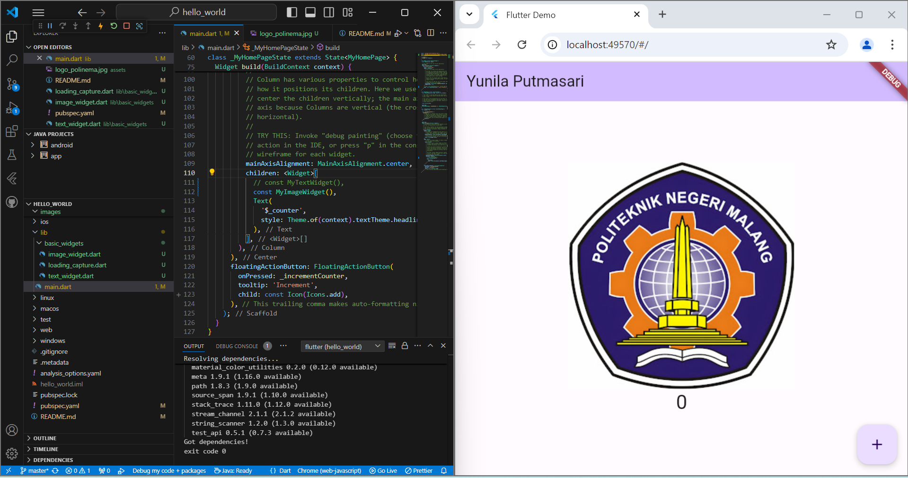
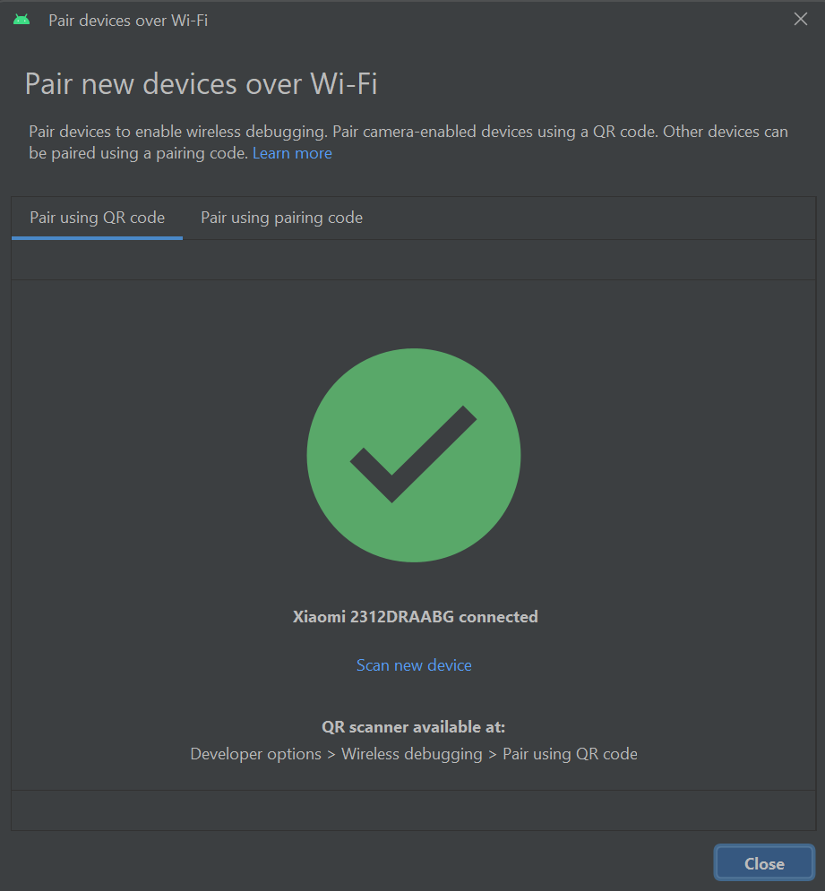
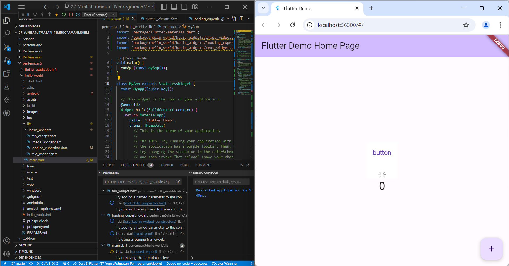
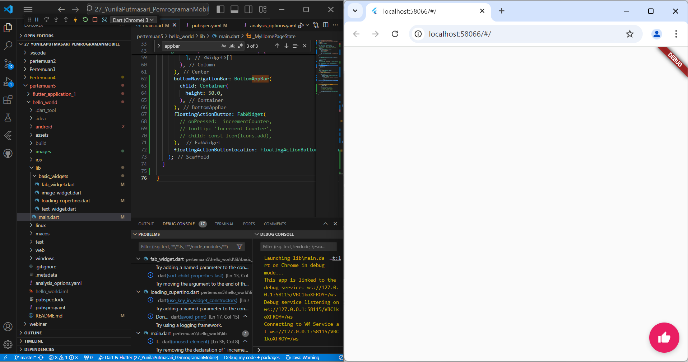
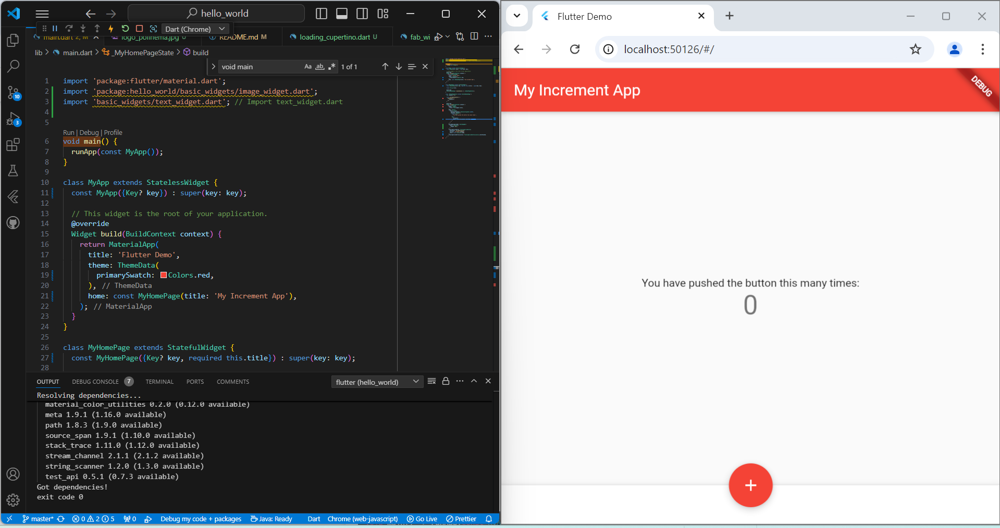
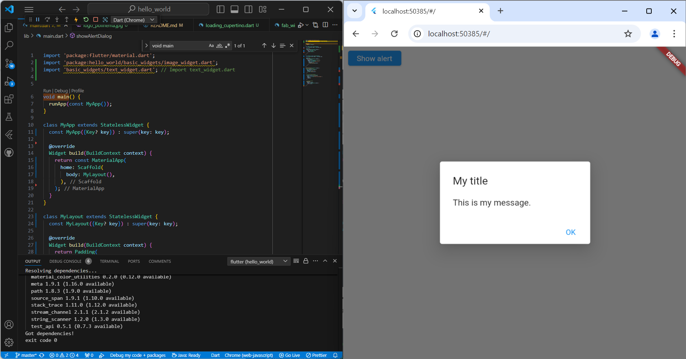
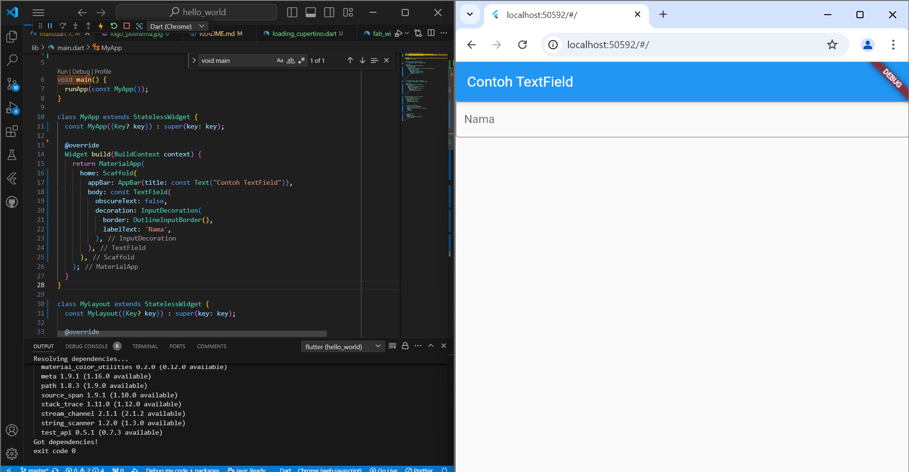
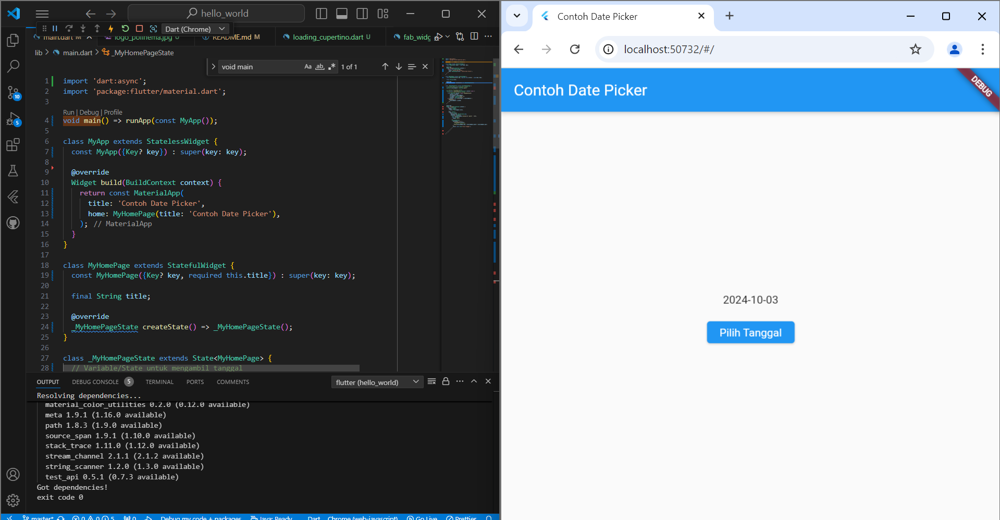

### Nama : Yunila Putmasari
### NIM : 2241720062
### Kelas : 3G

1. Selesaikan Praktikum 1 sampai 5, lalu dokumentasikan dan push ke repository Anda berupa screenshot setiap hasil pekerjaan beserta penjelasannya di file README.md!
Praktikum 1 : membuat project fluttter baru
Praktikum 3

Praktikum 4

2. Selesaikan Praktikum 2 dan Anda wajib menjalankan aplikasi hello_world pada perangkat fisik (device Android/iOS) agar Anda mempunyai pengalaman untuk menghubungkan ke perangkat fisik. Capture hasil aplikasi di perangkat, lalu buatlah laporan praktikum pada file README.md.

3. Pada praktikum 5 mulai dari Langkah 3 sampai 6, buatlah file widget tersendiri di folder basic_widgets, kemudian pada file main.dart cukup melakukan import widget sesuai masing-masing langkah tersebut!

Praktikum 5
Langkah 1: Cupertino Button dan Loading Bar

Langkah 2: Floating Action Button (FAB)

Langkah 3: Scaffold Widget

Langkah 4: Dialog Widget

Langkah 5: Input dan Selection Widget

Langkah 6: Date and Time Pickers

4. Selesaikan Codelabs: Your first Flutter app, lalu buatlah laporan praktikumnya dan push ke repository GitHub Anda!

5. README.md berisi: capture hasil akhir tiap praktikum (side-by-side, bisa juga berupa file GIF agar terlihat proses perubahan ketika ada aksi dari pengguna) dengan menampilkan NIM dan Nama Anda sebagai ciri pekerjaan Anda.

