### Praktikum 1: Membangun Layout di Flutter
1.  Buat Project Baru
   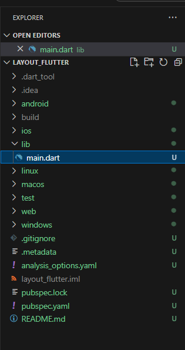
2. Buka file lib/main.dart
   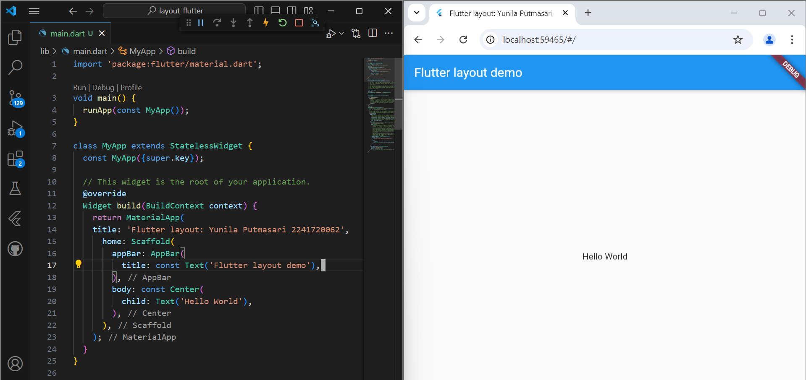
3. Implementasi title row
   

### Praktikum 2: Implementasi button row
1. Buat method Column _buildButtonColumn
   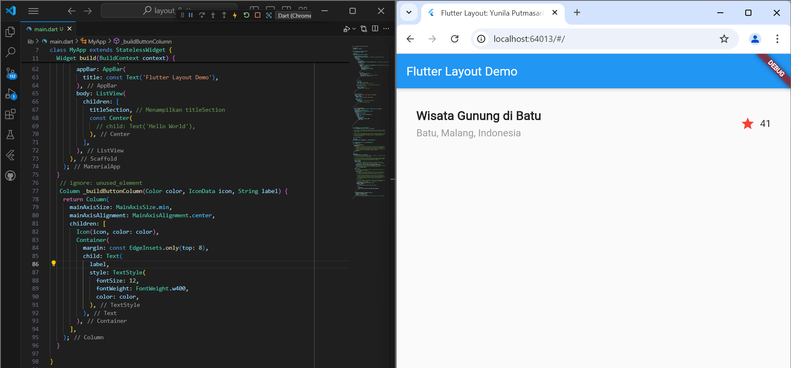
2. Buat widget buttonSection
   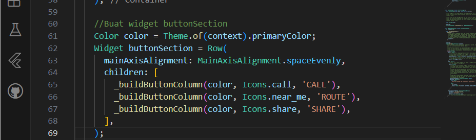
3. Tambah button section ke body
   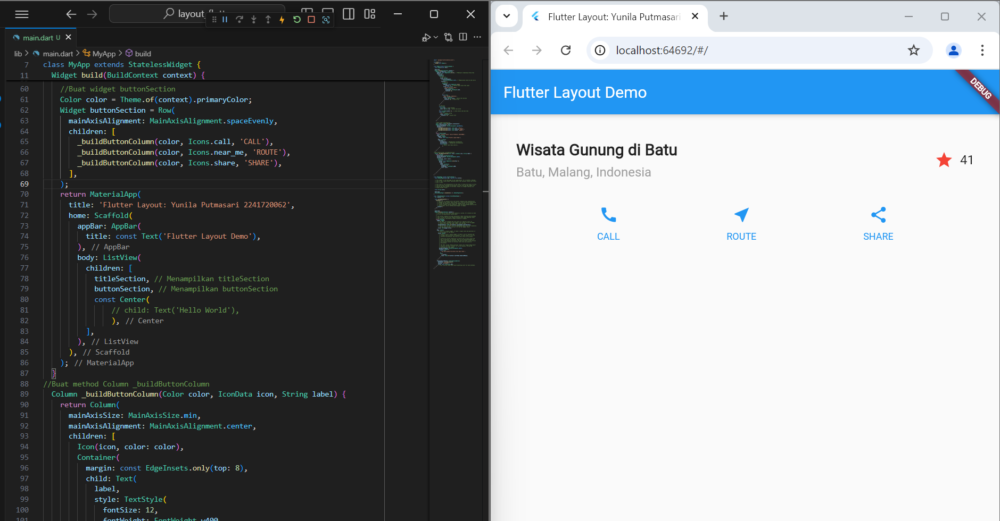

### Praktikum 3: Implementasi text section
1. Buat widget textSection
2. Tambahkan variabel text section ke body
   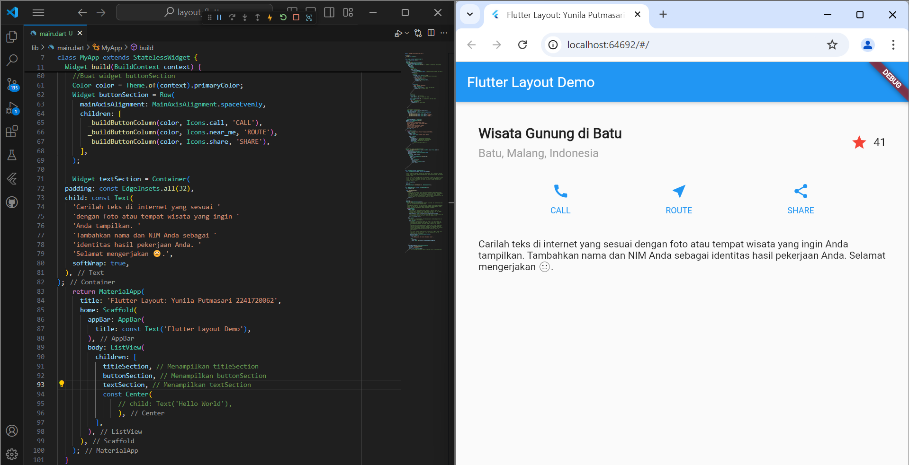

### Praktikum 4: Implementasi image section
1. Siapkan aset gambar
   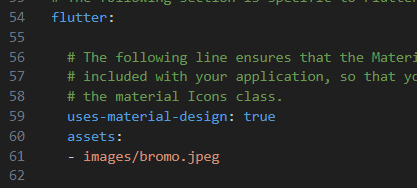
2. Tambahkan gambar ke body
   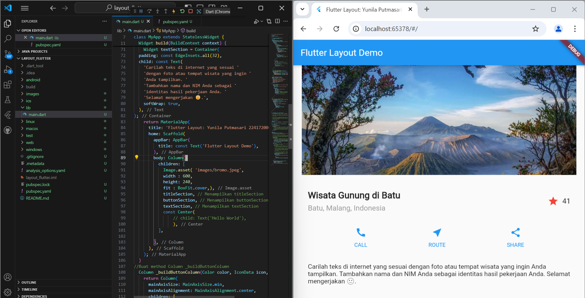
3. Terakhir, ubah menjadi ListView
   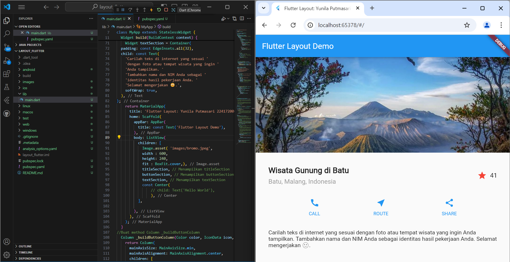

### Praktikum 5: Membangun Navigasi di Flutter
1. Siapkan project baru
   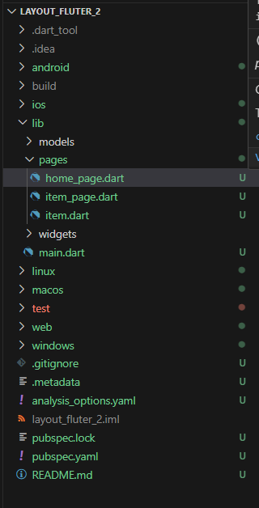
2. Mendefinisikan Route
   
3. Lengkapi Kode di main.dart
   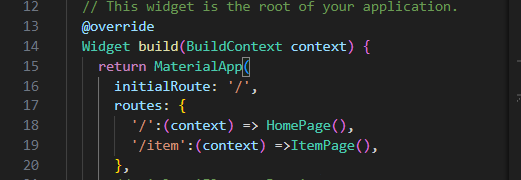
4. Membuat data model
   
5. Lengkapi kode di class HomePage
   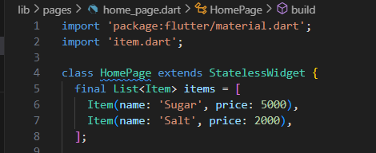
6. Membuat ListView dan itemBuilder
   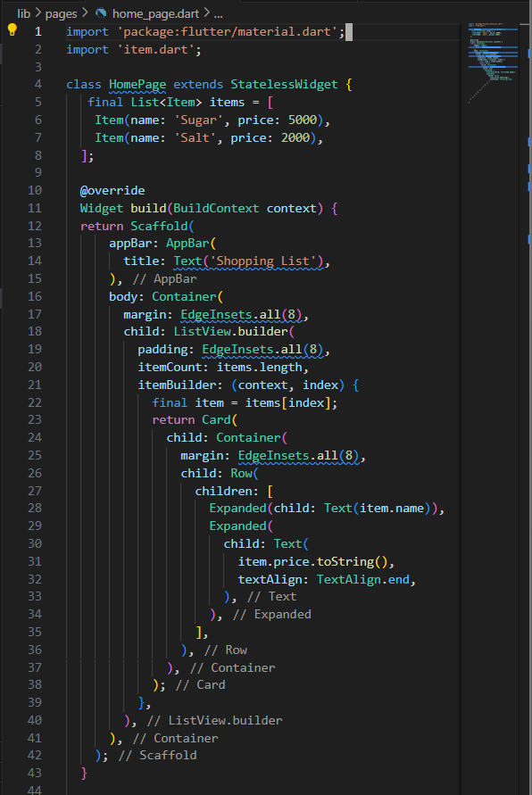
7. Menambahkan aksi pada ListView
   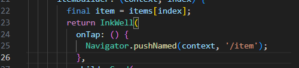
8. hasil halaman berikutnya
   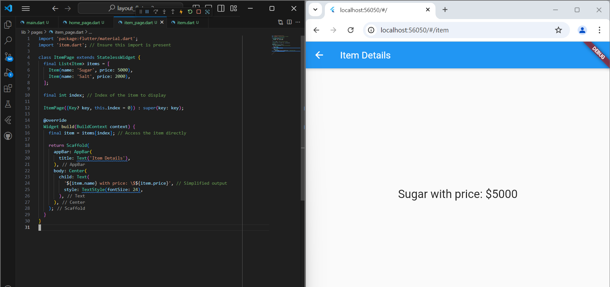