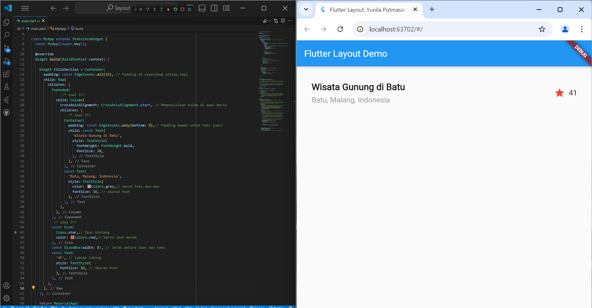

### Praktikum 1: Membangun Layout di Flutter
1.  Buat Project Baru
   
2. Buka file lib/main.dart
   
3. Implementasi title row
   

### Praktikum 2: Implementasi button row
1. Buat method Column _buildButtonColumn
   
2. Buat widget buttonSection
   
3. Tambah button section ke body
   

### Praktikum 3: Implementasi text section
1. Buat widget textSection
2. Tambahkan variabel text section ke body
   

### Praktikum 4: Implementasi image section
1. Siapkan aset gambar
   
2. Tambahkan gambar ke body
   
3. Terakhir, ubah menjadi ListView
   
